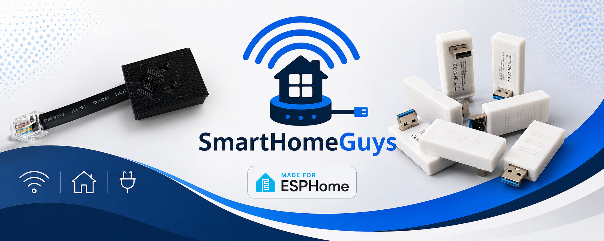

Welcome to SmartHomeGuys we’re a small UK based maker of smarthome hardware and design every device to solve a problem in our house and then open source it on here.

## The products
- DeskUp Pro - Controls a standing desk with an RJ12 socket with Home Assistant, Homey Pro, etc

  <a href="https://github.com/SmartHomeGuys/DeskUp-Pro-Controller-RJ12">Github Repo</a>&nbsp;&nbsp;&nbsp;&nbsp;
  <a href="https://www.ebay.co.uk/itm/226942026649">Purchase on eBay</a>&nbsp;&nbsp;&nbsp;&nbsp;
  
- Bluetooth Proxy Stick for Home Assistant - No cable needed the USB is built in (straight and angled variations)

  <a href="https://github.com/SmartHomeGuys/Bluetooth-Proxy">Github Repo</a>&nbsp;&nbsp;&nbsp;&nbsp;
  <a href="https://www.ebay.co.uk/itm/227206771185">Purchase on eBay</a>&nbsp;&nbsp;&nbsp;&nbsp;
  
